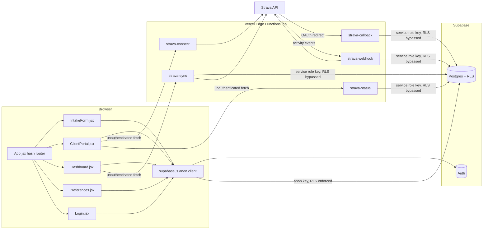
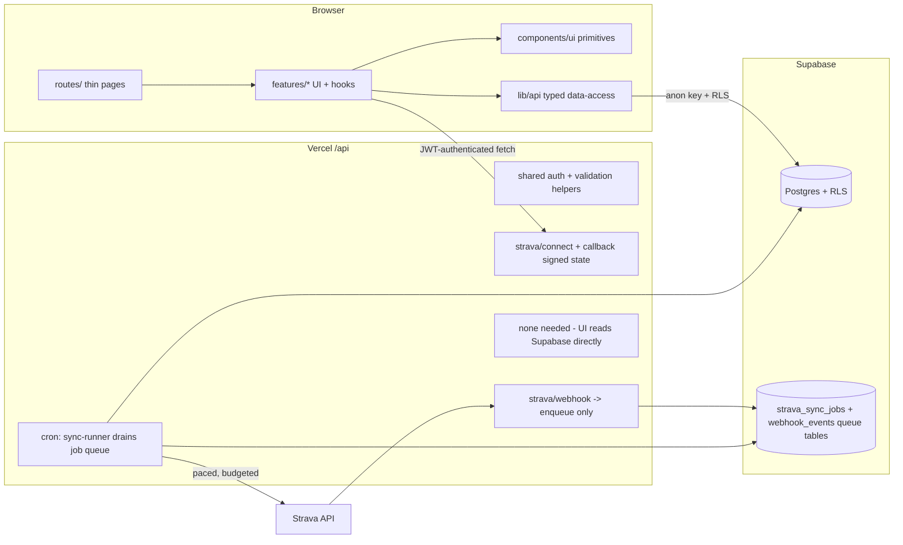
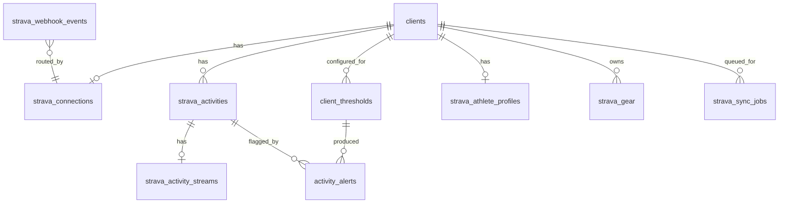

# Ndur — Refactoring & Architecture Blueprint

> **Document purpose:** Master architectural document guiding an incremental refactor of the Ndur endurance-coaching platform, and the architectural groundwork for the expanded Strava integration. This document contains **no implementation code** — it is the specification another coding LLM (Claude Sonnet) will follow. Save as `docs/BLUEPRINT.md`. *(The repo currently has no `docs/` directory or docs convention — creating `docs/` at the project root is part of Phase 1.)*
>
> **Repository analyzed:** `ndurcoaching/platform`, branch `main`, single project folder `marathon-coach - Git/` (~3,800 LOC excluding lockfile). Every file was reviewed in full; no areas were skipped.

---

## 1. Executive Summary

Ndur is a small, working, single-coach coaching platform: a public intake form, a client portal (mobile-first), a coach dashboard (desktop), a rule-based monthly plan builder, and a minimal Strava integration (OAuth connect, on-demand sync of summary activity data, and a webhook that is intended to push activities in near-real-time). Backend is Supabase (Postgres + Auth + RLS) with Vercel Edge Functions as the server-side API layer.

**Overall assessment:** The codebase is coherent for its size and shows good instincts in specific places — RLS is enabled on every table, Strava tokens are correctly kept server-side only, the coaches allowlist pattern is sound, and the shared plan serialization module (`src/lib/plan.js`) prevents coach/portal drift. However, the codebase has outgrown its structure. The two page components (`Dashboard.jsx` at 950 lines, `ClientPortal.jsx` at 442) are monoliths mixing styling, data access, business logic, and markup; there is no data-access layer, no routing library, no types, no tests, no linting, and no error boundaries. The Strava layer has **one critical functional bug** (the webhook filters on a field Strava does not send, so it never ingests anything), **several security gaps** (unauthenticated API routes, unsigned OAuth `state`, an XSS vector in PDF export), and a data model (7 summary columns per activity) that cannot support the planned expansion (streams, HR/power/cadence, thresholds, backfill).

**Stack discrepancies vs. the expected stack (confirmed against the repo):**

| Expected | Actually in repo |
|---|---|
| TypeScript "where applicable" | **No TypeScript anywhere.** All files are `.js`/`.jsx`. No `tsconfig`, no JSDoc types. |
| CSS/Tailwind | **No Tailwind.** Styling is inline JS style objects per page + CSS custom properties in `src/index.css`. Enormous duplication of style definitions across pages. |
| "Modern component architecture" | No component layer at all — zero files under a `components/` directory; every page is self-contained. No routing library (hand-rolled hash router in `App.jsx`), no state/data library (raw `useState` + direct Supabase calls in components). |
| Vercel deployment | Vercel is the live target (`vercel.json`, `api/` Edge Functions), **but Netlify remnants remain**: `netlify.toml.txt` and `netlify/functions/generate-plan.js` (a dead, Netlify-style Anthropic API proxy no longer called by any code). `README.md` still documents the Netlify deploy path and an AI plan-generation flow that no longer exists. |
| Supabase Edge Functions | Not used. All server code is Vercel Edge Functions. Fine — but the blueprint standardizes on Vercel and removes Netlify artifacts. |
| Standard env vars | Matches, with one landmine: `README.md` Step 5 instructs putting `VITE_ANTHROPIC_API_KEY` in `.env`. Any `VITE_`-prefixed variable is compiled into the public browser bundle. The variable is currently unused (dead feature), but the instruction must be deleted before someone follows it. The referenced `.env.example` file does not exist. There is also **no `.gitignore`** in the project folder, so a future `.env` would be committed by default. |
| Repo layout | The repo root contains a single folder literally named `marathon-coach - Git` (with spaces). All tooling paths, Vercel root-directory config, and shell ergonomics suffer for it. Package is named `marathon-coach` while the product is branded Ndur. |

**Top findings by severity (detailed in §12):**

- **Critical:** Webhook no-op bug (`aggregate_type` vs Strava's actual `aspect_type` field) — real-time ingestion silently does nothing; the app only appears live because the dashboard triggers a full re-sync every time a client is selected. Unauthenticated `api/strava-connect` allows anyone who knows/guesses a client UUID to link *their own* Strava account to that client, poisoning the coach's data (unsigned OAuth `state`, no session check, CSRF-able callback).
- **High:** XSS in `exportPDF` (client intake text interpolated unescaped into a generated HTML document opened in the coach's browser); `strava-sync` and `strava-status` endpoints unauthenticated; sync/webhook write inconsistent `activity_date` values (UTC timestamp vs local date string) into a `date` column, corrupting week-adherence math; sync path ingests *all* activity types while the webhook filters to runs; token refresh has a concurrent-writer race; 950-line Dashboard component.
- **Medium:** Plan stored as a JSON blob in a `text` column on `clients` (no history, no queryability); portal↔client identity coupled by email string matching instead of a `user_id` FK; date keys derived via `toISOString()` (breaks for UTC-positive timezones); duplicated pace color maps in 3 files; duplicated agreement legal text in 3 places; no index on `clients.email` (used in two RLS policies); dead Netlify function is an unauthenticated Anthropic proxy if ever deployed.
- **Low:** README drift, folder naming, missing `.gitignore`/`.env.example`, no lint/format config, minor naming inconsistencies.

The refactor is **incremental** — nothing here proposes a rewrite. The existing hash-router + Vite + Supabase + Vercel shape is preserved; the work is extraction, correction, and extension.

---

## 2. Overall Architecture

### 2.1 Current architecture



**Data flow in words:** The frontend talks to Supabase directly with the anon key; RLS is the security boundary. Anything involving Strava tokens goes through Vercel Edge Functions holding the service-role key. The dashboard triggers `strava-sync` (a pull of the last 60 summary activities) each time the coach selects a client, then reads the resulting rows from Supabase. The webhook is *supposed* to push new activities as they happen but currently never matches any event (§12, TD-01).

### 2.2 Strengths

- Correct trust boundary for secrets: tokens and service-role key never reach the browser; `strava-status` deliberately returns only a boolean.
- RLS enabled on every table, with a proper `coaches` allowlist replacing the earlier "any authenticated user is a coach" policy, and an additive "clients see only their own row" policy.
- Shared plan model (`src/lib/plan.js`) used by both writer (Dashboard) and reader (Portal), with defensive `parsePlan` fallback for legacy plain-text plans.
- Pure, testable business logic already partially separated (`planBuilder.js`, `strava.js` adherence math, `defaultPrefs.js`) — the seams for a real domain layer already exist.
- The intentional split — mobile-first client portal, desktop coach dashboard — is clean and should be preserved as-is (per product direction; see §10).

### 2.3 Weaknesses

- **No layering in the frontend.** Pages own styling constants (~200 lines each), Supabase queries, Strava fetches, derived business calculations, and markup. Any schema change touches JSX.
- **No server-side authentication.** The Edge Functions authenticate *nothing* — they trust query-string `client_id`/`clientId` values. Today the blast radius is limited (sync triggers work the coach would do anyway; status leaks a boolean), but `strava-connect` is genuinely exploitable (TD-02), and every planned expansion endpoint (streams, thresholds, backfill control) would inherit the same hole if the pattern isn't fixed first.
- **Sync-on-select coupling.** Selecting a client in the dashboard fires a blocking serverless→Strava→DB round trip. With one coach and few clients it works; with historical backfill and streams it will exhaust Strava rate limits (200 requests / 15 min, 2,000/day per app) and make the dashboard feel broken. Data currency must move to a background concern (webhook + scheduled reconciliation), with the UI only ever *reading* Supabase.
- **Schema shape can't hold the expansion.** `strava_activities` has 7 columns of summary data. There is nowhere to put HR/power/cadence/elevation, per-activity streams, athlete profile/gear/PRs, per-client thresholds, alert results, or backfill progress.
- **Duplication.** Pace colors defined in `plan.js`, redefined inline in `Dashboard.jsx` (`paceTypeBadge`), redefined again in `Preferences.jsx`. Agreement legal text exists in `IntakeForm.jsx`, again in `Dashboard.jsx` (`AGREEMENT_HTML`), and on an external site — three versions to drift. Card/button/badge styles re-declared per page.
- **Fragile date handling.** `toKey(date)` = `date.toISOString().slice(0,10)` converts a *local* midnight `Date` to a *UTC* date string. For US timezones this happens to work; for any UTC-positive locale the calendar keys shift a day. Combined with the sync/webhook `activity_date` inconsistency, date math is the least trustworthy part of the system.

### 2.4 Scalability concerns

- Strava rate limits are the binding constraint, not Postgres. Historical backfill of even 20 clients × 5 years of activities, plus streams per activity (1 additional API call each), demands a paced job system — not request-time fetching.
- Stream data volume: a 4-hour activity at 1 Hz is ~14,400 points × up to 8 stream types. Stored naively as JSON that's roughly 0.5–2 MB per long activity. Postgres handles this fine *if* streams live in their own table (fetched only for detail views), are compressed (JSONB + TOAST does this automatically), and list/graph queries never touch them (§5.3, §9).
- `clients.training_plan` as an ever-growing JSON string will eventually make every `select *` on clients heavy; plans should not ride along with profile reads (§5.2).
- Single-coach assumptions are mostly encoded correctly (coaches allowlist scales to N coaches), but `coach_prefs` and threshold config must stay per-coach-scoped as designed.

### 2.5 Recommended architecture



Principles, each mapped to later sections:

1. **UI reads Supabase; it never calls Strava paths for data.** All Strava freshness is a background concern: webhook enqueues, a scheduled runner drains a job queue within a rate budget, backfill is just a long-lived job. (§7)
2. **Every custom API route authenticates.** Portal-initiated routes verify the Supabase JWT and that the caller's identity maps to the `client_id` they name; coach-initiated routes verify coach membership. OAuth `state` is signed. (§6, §7)
3. **A single data-access layer** (`src/lib/api/`) owns every Supabase query, typed with JSDoc initially (TypeScript migration is an optional later phase — see §15 open question OQ-6). Components consume hooks, not clients. (§3, §7)
4. **A thin design system** extracted from what already exists (the CSS variables are good): `Card`, `Button`, `Badge`, `Field`, `Toggle`, plus chart theming, so the analytics layer inherits the visual language instead of forking it. (§10)
5. **Schema grows by addition:** activities widen, streams/thresholds/alerts/profile/sync-state get new tables, plans get their own table — all via forward-only migrations, no destructive changes. (§5)

---

## 3. Folder Structure

### 3.1 Repository root

Rename the project folder and adopt a conventional root. This is the one "disruptive" move in Phase 1, done first precisely so every later diff has stable paths. (Vercel's Root Directory setting must be updated in the same change — see §16, Task 1.)

```
/  (repo root — currently contains only "marathon-coach - Git/")
├── docs/
│   ├── BLUEPRINT.md          ← this document
│   └── decisions/            ← short ADRs as choices get made
├── api/                      ← Vercel Edge Functions (moved from subfolder)
├── supabase/
│   └── migrations/           ← numbered forward-only .sql files (see §5.6)
├── src/
├── public/
├── index.html
├── package.json              ← name: "ndur"
├── vercel.json
├── .gitignore                ← NEW (node_modules, dist, .env*, .vercel)
├── .env.example              ← NEW (names only, no values)
└── README.md                 ← rewritten; Netlify content and netlify/ deleted
```

### 3.2 `src/` layout (feature-first)

```
src/
├── main.jsx
├── App.jsx                   ← router shell only
├── routes/                   ← thin route components: compose features, no logic
│   ├── IntakeRoute.jsx
│   ├── PortalRoute.jsx
│   ├── CoachRoute.jsx        ← auth gate + Dashboard composition
│   └── PreferencesRoute.jsx
├── features/
│   ├── intake/               ← form sections, submit hook, agreement embed
│   ├── auth/                 ← Login, AuthScreen, useSession
│   ├── plan/                 ← calendar grid, plan editor, portal plan view,
│   │                            planBuilder engine, plan model, PDF export
│   ├── clients/              ← client list, profile card, profile editor
│   ├── prefs/                ← preferences page sections
│   ├── strava/               ← connect banner, connection badge, sync status
│   └── analytics/            ← NEW (Phase 7): progression charts, activity
│                                detail view, threshold config, alert flags,
│                                comparison views
├── components/ui/            ← Card, Button, Badge, Field, Select, Toggle,
│                                Stat, EmptyState, ErrorBoundary
├── lib/
│   ├── supabase.js
│   ├── api/                  ← ALL Supabase queries live here, grouped:
│   │   ├── clients.js
│   │   ├── plans.js
│   │   ├── prefs.js
│   │   ├── activities.js     ← summary lists, aggregates (never streams)
│   │   ├── streams.js        ← detail-view-only stream fetch
│   │   └── thresholds.js
│   ├── dates.js              ← toKey/buildCalendar/weekBounds, timezone-safe
│   ├── format.js             ← fmtDate, initials, avatarColor, pace formatting
│   └── adherence.js          ← moved from lib/strava.js (it's plan math,
│                                not Strava API code)
└── styles/
    ├── index.css             ← existing tokens, unchanged
    └── theme.js              ← JS mirror of tokens for charts/inline needs
```

**Why each move helps maintainability:**

- **`routes/` vs `features/`:** today "page" means a 400–950-line file. Splitting route shell from feature internals makes each feature independently reviewable and lets the analytics feature land later without touching the dashboard's plan-editing code.
- **`lib/api/` as the only Supabase call site:** schema evolution (e.g., plans moving off the `clients` table, §5.2) becomes a change in one module + its callers' hook, not a grep across JSX. It's also the natural seam for adding caching (§7.4) and, later, generated types.
- **`features/strava/` split from `features/analytics/`:** connection/consent UI is a portal concern shared today; analytics is coach-only and heavier. Keeping them separate lets code-splitting exclude all chart code from the client portal bundle (§9).
- **`lib/dates.js` centralization:** three files currently implement overlapping date logic (`plan.js`, `planBuilder.js`, `strava.js`), and the timezone bug lives in all of them. One tested module ends that class of bug.
- **`supabase/migrations/`:** the two existing SQL files are append-edited "diaries" containing placeholder emails and prose. Numbered, immutable migration files make the schema history reconstructible and are the prerequisite for the Strava schema expansion (§5.6).
- **`api/` naming inside Vercel functions:** adopt `api/strava/…` subpaths as new endpoints are added (Vercel supports nested routes), keeping the five existing function names stable until Phase 6 to avoid breaking the deployed webhook subscription URL.

---

## 4. Component Refactoring Plan (Conceptual)

This section is the *rationale* layer — what should change and why. Exact execution sequencing, per-file steps, and pseudocode live in §14.

### 4.1 `src/App.jsx`
- **Current responsibility:** hash parsing, session bootstrapping, route switching, and a loading screen — all in one component.
- **Problems:** route logic is stringly (`hash.startsWith`), session state is re-implemented again inside `ClientPortal.jsx` (two independent `onAuthStateChange` subscriptions exist in the app); adding a route means editing a chain of `if`s.
- **Proposed responsibility:** a declarative route table mapping hash prefixes → route components, wrapped in an `ErrorBoundary` and a single `SessionProvider` (context) that all routes consume. The hand-rolled hash router is *kept* (it's 15 lines and works with the Vercel rewrite) — a router library is not warranted at this route count.
- **Dependencies affected:** every page (they receive session via context instead of props/own subscriptions); `ClientPortal` drops its duplicate auth bootstrapping.

### 4.2 `src/pages/Dashboard.jsx` (950 lines → ~6 feature modules + 1 route shell)
- **Current responsibility:** style constants (~200 lines), avatar/formatting helpers, a full HTML-string PDF exporter, hard-coded legal text rendered via `dangerouslySetInnerHTML`, prefs loading, client CRUD, plan state, Strava sync triggering + adherence display, calendar editor, strength editor, glossary editor, agreements card.
- **Problems:** unreviewable size; state entanglement (plan state, profile draft state, Strava state interleaved); the `useEffect` keyed on `[clients]` that re-points `selected` at the fresh row is a subtle re-render feedback loop waiting to happen; sync-on-select couples UI to Strava availability; `AGREEMENT_HTML` via `dangerouslySetInnerHTML` is needless raw-HTML surface; `exportPDF` interpolates unescaped user-originated text into a generated document (XSS — TD-04).
- **Proposed responsibility:** `CoachRoute` composes: `ClientList` (sidebar), `AdherenceCard`, `ProfileCard`, `GlossaryCard`, `PlanEditor` (calendar + strength + notes + actions), `AgreementsCard`. Data flows through hooks (`useClients`, `usePlan(clientId)`, `useActivities(clientId)`, `usePrefs`). The Strava sync trigger becomes an explicit, debounced background refresh (and disappears entirely in Phase 6 when the job system owns freshness). PDF export moves to `features/plan/exportPdf.js` with mandatory HTML-escaping of every interpolated value; the agreement becomes a plain-JSX shared component.
- **Dependencies affected:** `plan.js`, `strava.js` (adherence math relocates to `lib/adherence.js`), new `lib/api/*` modules, new `components/ui/*`.

### 4.3 `src/pages/ClientPortal.jsx` (442 lines → auth screen + plan view + connect banner as separate modules)
- **Current responsibility:** its own session bootstrap, sign-in/sign-up screen, "not found"/"waiting" screens, Strava connect banner with URL-flash parsing, month plan renderer, strength/notes/glossary display.
- **Problems:** duplicate auth subscription (see 4.1); client row located by `ilike(email)` — identity by mutable string (see §5.2/§6); `StravaConnect` reads success/error from the URL hash but never clears it, so the flash persists across navigation; plan rendering logic (weeks slicing, totals) duplicates Dashboard's calendar math with slight differences.
- **Proposed responsibility:** `PortalRoute` composes `AuthScreen` (features/auth), `StravaConnectBanner` (features/strava), `PortalPlanView` (features/plan). Week-slicing/totals move into `features/plan/planSelectors.js` shared with the coach view. Client resolution moves to `lib/api/clients.getOwnClient()` and — after the migration in §5.2 — matches on `auth_user_id` instead of email.
- **Dependencies affected:** `App.jsx` session context; `lib/api/clients.js`; shared plan selectors.

### 4.4 `src/pages/IntakeForm.jsx`
- **Current responsibility:** intake form + inline legal text + post-submit account creation.
- **Problems:** legal text duplicated (drift risk against Dashboard copy and the external site of record); no client-side validation beyond "name and email present" (e.g., PR fields accept anything, age bounds only via HTML attrs); account-creation success path tells users to confirm email but doesn't link the eventual auth user to the client row (email matching papers over this — §5.2).
- **Proposed responsibility:** form sections extracted (`ProfileFields`, `HistoryFields`, `AgreementSection` — the latter shared with the dashboard's read-only card); a small validation helper in `features/intake/validate.js`; on account creation, record `auth_user_id` onto the client row via a dedicated authenticated API route or a `security definer` function (§6.3), removing the email coupling for new signups.
- **Dependencies affected:** shared `AgreementSection`; `lib/api/clients.js`.

### 4.5 `src/pages/Preferences.jsx` and `src/pages/Login.jsx`
- **Current responsibility:** fine functionally; Preferences duplicates the pace color/label maps and tier styling; Login duplicates card/button styles.
- **Proposed responsibility:** consume `components/ui` primitives and the single pace-token source in `features/plan/planModel.js` (renamed from `lib/plan.js`). No behavioral change.

### 4.6 `src/lib/planBuilder.js`, `src/lib/plan.js`, `src/lib/defaultPrefs.js`
- **Current responsibility:** the plan engine, plan (de)serialization + calendar/pace constants, default preference sets. These are the healthiest files in the repo.
- **Problems:** `planBuilder` has private copies of `toKey`, day-of-week math, and `ALL_DAYS` (drift risk with `plan.js`); `estimateRacePace` conflates experience labels ("Experienced" maps via substring `includes` — fragile against the intake's exact option strings); `plan.js` mixes data model (parse/serialize) with presentation tokens (colors).
- **Proposed responsibility:** `features/plan/planBuilder.js` imports date utilities from `lib/dates.js`; `features/plan/planModel.js` holds parse/serialize + type constants; `features/plan/planTheme.js` holds colors/backgrounds (single source consumed by Dashboard, Portal, Preferences, and the future charts). Behavior unchanged; unit tests added around `buildMonthPlan` and `parsePlan` before the move (§16 Task 5).
- **Dependencies affected:** all three pages; PDF export.

### 4.7 `src/lib/strava.js`
- **Current responsibility:** adherence math + connect-URL helper + prefs adjustment.
- **Problems:** misnamed — nothing here calls Strava; the connect-URL helper is portal UI concern; `adjustPrefsForAdherence` is plan-engine policy.
- **Proposed responsibility:** split into `lib/adherence.js` (pure math), `features/strava/connectUrl.js`, and fold `adjustPrefsForAdherence` into the plan feature next to `planBuilder`.

### 4.8 `api/*` Edge Functions
- **Current responsibility:** connect (redirect), callback (token exchange + upsert), status (boolean), sync (pull last 60 summaries), webhook (verify + ingest).
- **Problems:** no authentication anywhere; duplicated admin-client construction and token-refresh logic between `strava-sync` and `strava-webhook` (with *different* freshness rules — one refreshes when expired, the other 60s early); the webhook's fatal `aggregate_type` bug; inconsistent `activity_date` normalization and run-filtering between the two ingestion paths; webhook does fetch-and-write inline despite the comment acknowledging Strava's 2-second deadline; `strava-sync` caps at 60 activities with no pagination.
- **Proposed responsibility (Phase 6 target, transitional fixes earlier — see §7):** shared `api/_lib/` helpers (admin client, JWT verification, coach/client authorization, Strava client with token manager, activity normalizer); webhook becomes verify + enqueue only; a cron-driven runner performs all Strava reads within a rate budget; connect/callback gain signed state and session checks.
- **Dependencies affected:** `vercel.json` (cron config), new queue tables (§5.4), portal/dashboard fetch call sites (must send the Supabase JWT).

### 4.9 `netlify/functions/generate-plan.js`, `netlify.toml.txt`
- **Current responsibility:** none — dead code from the abandoned Netlify + AI-generation era.
- **Problems:** if ever deployed, `generate-plan` is an unauthenticated open proxy to the Anthropic API on the owner's key. The README still documents this era.
- **Proposed responsibility:** delete both, plus the README sections referencing them and the `VITE_ANTHROPIC_API_KEY` instruction.

---

## 5. Database Review

### 5.1 Current state

Three tables (`clients`, `coach_prefs`, `coaches`) from `supabase-setup.sql` and two (`strava_connections`, `strava_activities`) from `supabase-strava-migration.sql`. Observations:

- **RLS:** enabled everywhere; coach access gated by the `coaches` allowlist; client self-access by JWT-email match; Strava tables readable by coaches (and optionally clients' own rows), writable only via service role. This is a sound baseline. Two policy-level gaps: (a) the client self-select policy on `clients` uses `lower(auth.jwt()->>'email') = lower(email)` with **no index on `lower(email)`** — a per-row expression scan, and more importantly an identity model that breaks when either email changes (see 5.2); (b) `clients` has public INSERT `with check (true)` with no constraint or rate protection — acceptable for an intake form, but pair it with basic input `check` constraints (age bounds, email format) so garbage can't be inserted at the DB level.
- **Schema organization:** the SQL files are cumulative diaries edited over time (the client-portal RLS fix is appended to the "setup" file), containing a `YOUR_COACH_EMAIL_HERE` placeholder that makes them non-idempotent as-is. No migration numbering, no record of what's actually been applied to the live project (flagged in §15).
- **Query patterns:** `select('*')` everywhere, including `clients` — which drags the entire `training_plan` JSON string along with every list render of the sidebar. `strava_activities` reads are bounded (`limit 60`) and use the one existing index (`client_id, activity_date`) — good.
- **Data quality defects (from the dual ingestion paths):** `activity_date` is a `date` column, but `strava-sync` writes `a.start_date` (a full UTC ISO timestamp — Postgres truncates to the *UTC* date) while the webhook writes `start_date_local.slice(0,10)` (the *athlete-local* date). An evening run in Sioux Falls lands on different dates depending on which path saved it — silently corrupting weekly adherence. Additionally sync ingests every sport type while the webhook filters to runs, so ride mileage can inflate "actual miles." `strava_activity_id` is written as a string by sync and a number by the webhook (coerced fine by `bigint`, but indicative). These are correctness bugs to fix *now* (Phase 1), independent of the expansion.
- **Normalization:** `clients.training_plan` is a serialized JSON string in `text`. It works for one plan per client but forfeits history (each save overwrites), queryability (can't ask "planned miles next week" in SQL — the threshold/alert engine will need exactly that), and size hygiene.

### 5.2 Near-term schema corrections (non-breaking, additive)

1. **`clients.auth_user_id uuid null references auth.users(id)`** — backfill by email match once, set on signup thereafter (§6.3). Add RLS policies keyed on `auth.uid() = auth_user_id`, keep the email-match policies temporarily for legacy rows, then retire them. Add `create index on clients (lower(email))` in the interim.
2. **`training_plans` table** — `id`, `client_id fk`, `plan jsonb`, `created_at`, `updated_at`, optional `month_anchor date`. One current row per client (unique on `client_id`) migrated from the text column; history can come later by relaxing the unique. `clients.training_plan` is kept, frozen, and dropped only after two release cycles (constraint: avoid destructive changes). JSONB (not text) so the alert engine can extract planned mileage in SQL.
3. **Normalize `activity_date` semantics:** decide and document that it means *athlete-local calendar date*; add a companion `start_at timestamptz` for real ordering. Fix both ingestion paths to comply, and one-time repair rows written by the sync path (identifiable where `created_at` clusters from sync runs — if ambiguous, re-sync repairs them since upsert is keyed on `strava_activity_id`).

### 5.3 Strava expansion schema (designed now, built in Phase 6)

The shape below deliberately separates *hot list data* (small, indexed, always loaded) from *cold detail data* (large, loaded per activity) from *configuration* and *operational state*.



- **`strava_activities` (widened, same table):** add `avg_hr numeric`, `max_hr numeric`, `avg_power numeric`, `max_power numeric` (aka watts), `avg_cadence numeric`, `elevation_gain_m numeric`, `elevation_loss_m numeric`, `avg_speed_mps numeric`, `perceived_exertion numeric`, `suffer_score numeric`, `sport_type text`, `start_at timestamptz`, `timezone text`, `has_streams boolean default false`, and `raw jsonb` (the full Strava DetailedActivity payload — future-proofing so unmapped fields aren't lost; TOASTed, never selected in lists). Keep numeric summary columns as *columns*, not JSON, because the progression graphs and threshold engine filter/aggregate on them.
- **`strava_activity_streams`:** `activity_id bigint pk references strava_activities(strava_activity_id)`, `streams jsonb` (object keyed by stream type: time, latlng, heartrate, watts, cadence, velocity, altitude, distance), `resolution text`, `point_count int`, `fetched_at`. One row per activity, one JSONB document: streams are always read together for a detail view, JSONB compresses well, and this avoids a per-stream-type row explosion. If sizes ever pressure the table, the escape hatch is moving `streams` to Supabase Storage with a pointer column — an isolated change because only `lib/api/streams.js` reads it. RLS: coach-only select (this is coach-facing data by product decision; no client policy at all).
- **`client_thresholds`:** `id`, `client_id`, `coach_id` (references coaches — thresholds are the coach's config), `metric text` (enumerated: avg_hr, max_hr, pace_per_mile, weekly_miles, avg_power, cadence, …), `scope text` ('activity' | 'week'), `activity_filter jsonb null` (e.g., restrict to pace type easy, or sport Run), `min_value numeric null`, `max_value numeric null`, `active boolean`, `note text`, timestamps. Range semantics: a flag fires when the observed value falls outside `[min,max]` (either bound nullable).
- **`activity_alerts`:** `id`, `client_id`, `threshold_id fk`, `activity_id null` (null for week-scope alerts), `week_start date null`, `metric`, `observed_value numeric`, `bound_violated text` ('above'|'below'), `evaluated_at`, `acknowledged_at null`. Evaluation happens **server-side at ingestion time** in the sync runner (not in the browser) so alerts exist the moment data lands, are consistent regardless of which UI reads them, and can later drive notifications. Re-evaluation of history when a threshold changes is a queued job (§7.3). RLS: coach-only.
- **`strava_athlete_profiles`:** `client_id pk`, `raw jsonb` (Strava DetailedAthlete), plus extracted columns for display (`weight_kg`, `ftp`, `city`), `fetched_at`. **`strava_gear`:** `id text pk` (Strava gear id), `client_id`, `name`, `distance_m`, `retired boolean`, `raw jsonb`. PRs/best-efforts arrive on detailed activities (`raw.best_efforts`) — surfaced via a view rather than a table initially.
- **`strava_sync_jobs`** (the backfill/refresh state machine): `id`, `client_id`, `job_type` ('backfill_activities' | 'fetch_detail' | 'fetch_streams' | 'refresh_profile' | 'reevaluate_thresholds'), `cursor jsonb` (e.g., `{before: <epoch>, page: n}` for backfill), `status` ('pending'|'running'|'done'|'error'), `priority int`, `attempts int`, `last_error text`, `not_before timestamptz`, timestamps. Historical backfill is expressed as one `backfill_activities` job whose cursor advances per page (Strava: `GET /athlete/activities?before=&per_page=100`, paginated), spawning `fetch_streams`/`fetch_detail` jobs per activity; the runner drains within budget and reschedules via `not_before` when the budget is spent (§7.3). Index on `(status, not_before, priority)`.
- **`strava_webhook_events`:** raw event `jsonb`, `received_at`, `processed_at null`, `error text null`. The webhook writes here and returns 200 immediately; the runner converts events into jobs. This makes ingestion durable (today's webhook comment admits errors are "swallowed rather than retried").

**Indexes for the analytics workload:** existing `(client_id, activity_date)` remains the workhorse for progression ranges; add partial index `(client_id, start_at) where sport_type = 'Run'`; `activity_alerts (client_id, acknowledged_at) where acknowledged_at is null` for the "open flags" view; nothing on `streams` (PK access only).

### 5.4 Migrations discipline (§3 `supabase/migrations/`)

Adopt numbered, immutable files: `0001_baseline.sql` (a faithful, idempotent restatement of current production schema — see OQ-1 on verifying what production actually has), `0002_fix_activity_date_semantics.sql`, `0003_auth_user_link.sql`, `0004_training_plans.sql`, `0005_strava_expansion.sql`, `0006_thresholds_alerts.sql`, `0007_sync_jobs.sql`. Each additive; destructive steps (dropping `clients.training_plan`, retiring email-match policies) get their own late-stage migrations gated on verification. Recommend the Supabase CLI for applying + tracking, but plain SQL files in-repo are the non-negotiable part.

---

## 6. Authentication Review

- **Login flow (coach and client):** email/password via Supabase Auth; both good. The coach login (`Login.jsx`) has no relationship to the `coaches` table — any authenticated user reaching `#/coach` renders the dashboard shell and simply sees empty data because RLS filters everything. Not a security hole, but confusing; the `CoachRoute` should check membership (a cheap `select` against a new RLS-readable "am I a coach" view or an RPC) and show a proper "not authorized" screen.
- **Session handling:** two independent session subscriptions (App + ClientPortal). Consolidate into one `SessionProvider` (§4.1). No token handling issues client-side — supabase-js manages refresh.
- **Protected routes:** hash routing means no server-side protection, which is fine — the data layer (RLS) is the boundary, and that's the right design. Keep it; document it.
- **Client identity (the real issue):** the portal↔client link is email string matching in three places (portal query `ilike`, RLS policy JWT-email match, activities client policy). Emails are mutable on both sides (coach can edit `clients.email` in the profile card; users can change auth email), and matching is the only thing standing between a client and *someone else's* plan if a coach ever typos an email into another client's record. Move to `clients.auth_user_id` (§5.2) with policies on `auth.uid()`; link at signup time via a `security definer` RPC (`link_client_account`) that matches the *verified* JWT email to an unlinked client row exactly once. Email confirmation must remain ON (it already is per setup docs) — it's what makes the one-time email match trustworthy.
- **Strava OAuth token storage:** correctly server-side only, RLS-locked, service-role access only, status endpoint returns a boolean. Good. Gaps: (a) **`state` is the bare client UUID, unsigned** — the callback trusts it, enabling both cross-linking (attacker authorizes *their* Strava against a victim's client_id) and login-CSRF-style flows. `state` must become a short-lived HMAC-signed token (payload: client_id, expiry, nonce) minted by `strava-connect` *after verifying the caller's Supabase JWT matches that client*. (b) **Refresh race:** sync and webhook can refresh the same token concurrently with different logic; last writer wins and a stale refresh_token can be persisted. Centralize in one token manager that refreshes 5 minutes early and persists conditionally (update … where `expires_at` = previously-read value; on conflict, re-read). (c) **Deauthorization unhandled:** Strava webhooks send `updates: {authorized: "false"}` on revoke — handle it by deleting/flagging the connection so the UI can prompt reconnection. (d) On token-exchange, verify granted `scope` includes what was requested; users can uncheck scopes on Strava's consent screen.
- **Scope expansion (Phase 6):** request `activity:read_all,profile:read_all` (comma-separated per Strava). Existing connections carry only `activity:read_all`; store granted scopes on `strava_connections` (`scopes text`) and surface a "reconnect to enable full data" banner for under-scoped connections rather than silently missing profile data.


---

## 7. API / Data Layer

### 7.1 Supabase client organization (frontend)

One anon client (`lib/supabase.js`, unchanged) consumed **only** by `lib/api/*` modules. Each module exposes intention-named functions (`listClients`, `getOwnClient`, `saveProfile`, `getPlan`, `savePlan`, `listActivitiesInRange`, `getWeeklyVolume`, `getStreams`, `listOpenAlerts`, `listThresholds`, `saveThreshold`). Components never import `supabase` directly — enforce with a lint rule once ESLint lands (Phase 1). Column lists replace `select('*')` everywhere; the client sidebar list selects only identity + status fields (dropping the plan blob from list reads is the single biggest cheap query win — §9).

### 7.2 Server/client boundaries

Rule of thumb after the refactor: **reads go browser→Supabase under RLS; anything touching Strava or the service-role key goes through `api/`; every `api/` route authenticates.** A tiny shared layer under `api/_lib/` provides: `adminClient()` (one construction, not four copies); `requireUser(req)` (verify the Supabase JWT from the `Authorization` header using the project JWT secret / `auth.getUser`); `requireCoach(user)`; `requireOwnClient(user, clientId)` (joins through `clients.auth_user_id`); `signState()/verifyState()` (HMAC, `STRAVA_STATE_SECRET` env var); `stravaClient(connection)` (token manager per §6); `normalizeActivity(raw)` (the *single* mapper both ingestion paths use: local-date, `start_at`, run/sport filter policy, unit conversions). The webhook's GET verification stays unauthenticated by necessity; its POST is validated by shape + athlete lookup (Strava doesn't sign webhook bodies — the durable-queue design bounds the damage of forged events to harmless job churn, and `object_id` fetches are made against the *owner's* token so forged IDs can't exfiltrate other athletes' data).

### 7.3 Strava sync architecture (Phase 6 target)

- **Webhooks vs polling — decision: webhooks primary, scheduled reconciliation secondary.** Webhooks (already registered) give near-real-time updates at ~zero request cost, which matters because rate limits are the scarce resource. But webhooks miss events (outages, the deploy gap, manual uploads edited later), so a low-frequency reconciliation job (per client, every ~6h: fetch activities `after` last-seen) heals drift. Pure polling would burn the budget: 20 clients × 15-minute polls ≈ 1,920 requests/day before fetching any detail — right at the 2,000/day default ceiling.
- **Pipeline:** webhook → insert `strava_webhook_events`, return 200 in <2s (no Strava calls inline — this also fixes the current design's acknowledged flaw). A **Vercel Cron** invocation (every minute or two hitting `api/strava/run-jobs`, protected by `CRON_SECRET`) converts unprocessed events into jobs and drains `strava_sync_jobs` in priority order: webhook-driven fetches first, reconciliation next, backfill last. *(Vercel Edge/serverless functions cannot reliably do work after responding, which is why a cron-drained queue rather than post-response processing — see OQ-4 on plan limits for cron frequency.)*
- **Rate-limit awareness:** the runner keeps a budget row (requests used per 15-min window and per day — Strava returns usage in `X-RateLimit-Usage` headers; persist the latest reading). Each run computes remaining budget, reserves headroom (e.g., never consume the last 20% of the 15-min window, so webhook-driven freshness always has room), executes jobs until spent, and reschedules the rest with `not_before` = next window. On a 429, back off the whole queue to the window boundary.
- **Historical backfill on connect:** enqueue `backfill_activities` (paginated `before` cursor, 100/page — a 1,000-activity history is ~10 list calls) and `refresh_profile`. Per ingested activity where analytics need depth, enqueue `fetch_streams` (1 call each — this dominates cost: 1,000 activities = 1,000 calls ≈ spread over ~1–3 days at safe pacing). Make stream backfill *policy-driven*: default to streams for the trailing 12 months and on-demand for older activities when the coach opens a detail view (an "open detail → enqueue high-priority stream fetch → UI shows 'loading detail data'" path), so backfill cost stays proportional to what's actually looked at.
- **Kill sync-on-select** (transitional step even before Phase 6): the dashboard stops calling `/api/strava-sync` on client select and just reads Supabase; a manual "Refresh from Strava" button remains as an authenticated escape hatch until the queue exists.

### 7.4 Caching, error handling, retry

- Frontend: adopt **TanStack Query** as the one new runtime dependency of the refactor (justified: request de-duplication, cache invalidation after saves, background refetching for the dashboard — exactly the problems currently hand-rolled with `cancelled` flags and `fetchClients()` re-pulls). Query keys mirror `lib/api` functions. Mutations invalidate narrowly (saving a plan invalidates that client's plan + adherence, not the whole client list).
- Errors: `lib/api` functions throw typed error objects; features render inline error states; a global `ErrorBoundary` catches render crashes. Today's pattern of `if (!error) { …success… }` with the failure path silently doing nothing (e.g., `savePlan`) must always surface a visible failure state.
- Retry: reads retry via TanStack defaults; mutations don't auto-retry. Server-side, job attempts are capped (e.g., 5) with exponential `not_before` backoff; poison jobs park in `status='error'` with `last_error` for a small admin view later.

---

## 8. Data Visualization & Analytics Layer

This is a coach-facing feature set (`features/analytics/`, rendered only inside the desktop dashboard; per product direction, clients never see it unless the coach later builds explicit sharing).

### 8.1 Architecture: three layers

1. **Query layer** (`lib/api/activities.js`, `streams.js`, `thresholds.js`): range-parameterized reads returning *plain domain shapes*, not chart shapes. Key functions: `getDailyVolume(clientId, range)`, `getActivitySeries(clientId, metric, range, filters)` (one point per activity: date, value, activity id, pace type), `getWeeklyAggregates(clientId, range)` (SQL `date_trunc` aggregation — aggregate in Postgres, not the browser), `getActivityDetail(activityId)` (summary row + alerts), `getStreams(activityId)`.
2. **Selector layer** (`features/analytics/selectors/`): pure functions turning domain shapes into chart-ready series — bucketing to week/month, rolling averages, pace conversion (mps → min/mi), stream downsampling (§9), pairing planned-vs-actual by joining the plan JSONB with activity rows, and comparison alignment (normalizing two activities onto a common distance or time axis for overlay). Pure = unit-testable without rendering.
3. **Component layer:** a small set of *data-driven, reusable* chart components — `TrendChart` (line/area, any metric, any bucketing, custom ranges), `VolumeBars` (weekly/monthly planned-vs-actual), `StreamChart` (multi-series time axis with hover-synced crosshair across HR/pace/power/cadence panels), `ComparisonOverlay` (N activities on a shared axis), `AlertFlag` (the visual out-of-range marker). Each takes `{series, thresholdBands?, onPointClick?}` — thresholds render as shaded bands so "outside range" is visually self-evident, and clicking a point deep-links to the activity detail view.

### 8.2 Feature composition

- **Progression graphs:** an `AnalyticsPanel` on the client detail view with a metric switcher (pace / HR / distance / weekly volume) and a range control (4w / 12w / 6m / custom). Backed by `getActivitySeries`/`getWeeklyAggregates`; never touches streams.
- **Per-activity detail view:** routed as `#/coach/activity/:id` (the hash router gains one parameterized route). Layout: summary header (all widened columns), alert flags for this activity, stream panels (lazy-loaded on mount — §9), splits if present in `raw`, and a "compare with…" picker feeding `ComparisonOverlay`.
- **Threshold config + flags:** a `ThresholdEditor` card per client (CRUD against `client_thresholds`); flags surface in three places from the same `activity_alerts` reads — a count badge on the client list item, an "open flags" strip on the client detail view, and inline markers on charts/detail. Evaluation is server-side at ingestion (§5.3); the UI only reads and acknowledges.
- **Cross-activity analysis:** enabled structurally by (a) normalized summary columns (any two activities are comparable via plain column reads) and (b) the selector-layer axis normalization for stream overlays. No special storage needed.

### 8.3 Charting library recommendation

**Recharts.** Rationale against the stack: React-idiomatic (declarative components fit the existing style), no Tailwind/global-CSS assumptions (themes via props — feed it `styles/theme.js` mirroring the existing CSS variables so charts inherit the DM Sans/paper aesthetic), handles the required set (line, area, bar, reference areas for threshold bands, synced tooltips) without the bundle weight or imperative API of D3/ECharts. Constraint to respect: Recharts degrades above a few thousand points per series — acceptable *because* the architecture mandates downsampled streams (§9) and SQL-side aggregation. If a future need exceeds that (e.g., full-resolution zoomable streams), swap only the `StreamChart` internals for uPlot behind the same props — the layering makes that a contained change. All chart code lives in `features/analytics/` and is lazy-loaded (§9) so the portal and non-analytics dashboard paths pay nothing.

---

## 9. Performance Improvements (prioritized by impact)

1. **Stop shipping the plan blob with every client-list read** (High, trivial): sidebar query selects identity/status columns only; the plan loads on selection via `getPlan`. Also removes the "re-point `selected` after `fetchClients`" effect loop by keying detail data on `clientId` rather than object identity.
2. **Remove sync-on-select** (High): client selection becomes a pure Supabase read (fast, offline-tolerant of Strava outages); freshness moves to webhook/queue (§7.3). Until Phase 6, keep an explicit refresh button.
3. **Streams: never in list paths, always downsampled for rendering** (High, Phase 6/7): stream JSONB is fetched only in the detail route; the selector layer downsamples to ≤ ~1,000 points per series before charting using LTTB (Largest-Triangle-Three-Buckets — preserves visual shape, standard for time-series thinning); full resolution stays available for on-demand zoom windows (re-slice + re-downsample the in-memory document — no refetch). Server-side, request Strava's `medium` resolution streams by default for backfill (caps points ~1,000/stream) and `high` only on demand.
4. **Aggregate in SQL, not JS** (Medium): weekly/monthly volume via `date_trunc` grouped queries (or a `weekly_client_volume` view) instead of shipping 60 rows to reduce in the browser — matters once backfill makes histories thousands of rows. Range-bounded queries ride the existing `(client_id, activity_date)` index.
5. **Code-splitting by route** (Medium): dynamic-import the coach bundle (Dashboard + Preferences + analytics) so the public intake form and mobile portal — the latency-sensitive, cellular-network surfaces — ship none of it. Analytics (charts lib) is a nested lazy chunk within the coach bundle. Today everything is one bundle; Recharts would otherwise land on the intake form.
6. **Memoization where it counts, not everywhere** (Low): the 42-cell calendar re-creates every cell's inline style objects and re-renders on any keystroke in any cell. Memoize `CalendarCell` on `(day, isToday, isCurrentMonth)` and move static style objects to module scope (extraction to `components/ui` largely does this for free). Don't blanket-`useMemo` the small components.
7. **Font loading** (Low): self-host DM Sans/DM Mono or add `display=swap` is already present; fine — just drop the duplicated Google Fonts `@import` inside the generated PDF HTML in favor of system-font fallback for print (removes a network dependency from printing).

---

## 10. UI Consistency

**Preserve the intentional split:** mobile-first client portal (iPhone) vs desktop coach dashboard (Windows laptop). Do **not** unify responsive behavior across the two surfaces. Consistency work below is about shared *tokens and primitives*, not shared layouts.

- **Duplicated UI to consolidate:** card container (defined 5×), primary/ghost/danger buttons (5×), status badge (green/amber pill — 4×, with two slightly different green text colors `#2a6e28` vs `#2a6e3a`), form field group (label+input — 3×), toggle switch, stat box, logo lockup (4×), empty/waiting states. Extract into `components/ui/` matching the *existing* visual language — this is codification, not redesign.
- **Design tokens:** `index.css` variables are the de-facto system and are good; add the pace palette to it (currently hard-coded hex in three JS files with minor drift, e.g., fartlek `#e8f0fc` vs `#e8f0fd`) and mirror tokens in `styles/theme.js` for charts and the PDF exporter.
- **Typography/spacing:** font sizes are ad-hoc per component (9–24px, ~14 distinct values). Define a small scale (11/12/13/14/15/18/22) as tokens and normalize opportunistically during extraction — not as a dedicated sweep.
- **Shared forms:** intake, profile editor, and preferences all hand-roll fields; the `Field` primitive plus a `Select` with the custom chevron (currently an inline SVG data-URI in Dashboard only) unifies them.
- **New visualization components (§8) must join the system from day one:** charts consume `theme.js` tokens (paper background, border color, DM Sans labels, pace palette for series colors); `AlertFlag` uses the existing amber/red badge language rather than inventing an alert style; the activity detail view is built from `Card`/`Stat`/`Badge`. Add a lightweight `docs/decisions/ui-tokens.md` cataloging tokens so the implementing LLM doesn't improvise.
- **Agreement text:** single `AgreementContent` component (plain JSX, no `dangerouslySetInnerHTML`) used by intake and dashboard; note in §15 that the external site copy remains a third source of truth to reconcile (which version is legally canonical is a business question — OQ-7).

---

## 11. Security Audit

*(Severity mapping and remediation sequencing in §12/§13; secrets are referenced by name only.)*

- **Secrets in repo:** **None found.** No `.env`, no keys, no tokens in the working tree or the (shallow) history available. Residual risks: no `.gitignore` exists (a local `.env` would be staged by default — fix in Phase 1); `README.md` instructs creating `VITE_ANTHROPIC_API_KEY`, which if followed embeds an Anthropic key in the public JS bundle — delete the instruction (the feature it served is dead). Verify against full clone history before closing (OQ-2).
- **Unauthenticated API routes:**
  - `api/strava-connect` — accepts any `client_id`, mints a real OAuth URL with `state` = that UUID unsigned. An attacker with any client UUID can complete the flow with *their own* Strava account, binding their data to the victim's coaching record (data poisoning; also silently *replaces* an existing connection via upsert). Fix: require portal JWT, require the JWT's client mapping to equal `client_id`, sign state (§6).
  - `api/strava-callback` — trusts unsigned state (CSRF: a victim coach/client lured through an attacker-initiated flow links the attacker-chosen record). Fix: verify signed state, expiry, nonce.
  - `api/strava-sync` — anyone can trigger Strava API consumption per client (rate-limit griefing) — require coach JWT (then delete the route entirely in Phase 6).
  - `api/strava-status` — leaks connection existence + timestamp per UUID; low sensitivity, still gate to the owning client's JWT.
  - `netlify/functions/generate-plan.js` — dead but dangerous pattern (open Anthropic proxy); delete.
- **XSS:** `exportPDF` interpolates `client.name`, `goal_race`, day `notes`, glossary, and strength text into raw HTML written into a new window. Intake fields are athlete-controlled → an athlete can execute script in the coach's browser at export time. Fix: escape every interpolation (single `escapeHtml` helper) — highest-priority code fix alongside the webhook bug. `AGREEMENT_HTML` via `dangerouslySetInnerHTML` is static/not injectable today but is the same class of surface; replace with JSX. React's default escaping covers the rest of the app; no other `dangerouslySetInnerHTML` uses exist.
- **SQL injection:** none — all DB access is supabase-js parameterized builders; no string-built SQL anywhere.
- **RLS review:** solid baseline (§5.1). Confirmed by policy reading: clients cannot see other clients' rows (email-match policy is self-scoped), cannot see `strava_connections` at all (tokens unreachable via anon key), can optionally see only their *own* activities. **Coach-only restriction for expansion data:** per the product decision that Strava analysis is coach-facing, the new tables (`strava_activity_streams`, `client_thresholds`, `activity_alerts`, `strava_athlete_profiles`, `strava_gear`, job/queue tables) get **coach-select-only** policies and no client policies whatsoever; the existing client self-read policy on `strava_activities` may remain (summary-level, own-rows only) or be dropped — flagged as a product choice (OQ-8). The migration that widens `strava_activities` adds coach-facing columns to a table clients can partially read; since the client policy is row-scoped (own rows) and the athlete already owns this data on Strava, this is acceptable — but if the coach wants HR/power hidden even from the athlete's own portal, enforce via a column-limited view for the client policy instead.
- **Authorization drift risk:** the coaches allowlist is edited only via SQL editor — fine for now; document the procedure in the runbook portion of the new README.
- **Client-side misc:** portal Strava flash params parsed from the hash but never cleared (cosmetic); `window.open`-based PDF window uses `document.write` (works; keep, but escaped); no CSP — add a basic one via `vercel.json` headers in a later hardening pass (Low).

---

## 12. Technical Debt Register

### Critical

- **TD-01 — Webhook never ingests (field-name bug).** `api/strava-webhook.js` filters on `event.aggregate_type`; Strava's payload field is `aspect_type`, so the condition is always false and every activity event is silently dropped. The system only appears live because the dashboard re-syncs on client select. Files: `api/strava-webhook.js`. Fix: correct the field name (immediate patch), then supersede with the enqueue design (Phase 6). Also handle `updates.authorized === "false"` deauth events while in the file.
- **TD-02 — Unauthenticated OAuth initiation + unsigned state.** Cross-account linking / CSRF as described in §11. Files: `api/strava-connect.js`, `api/strava-callback.js`, portal connect banner (must send JWT / use a fetch-then-redirect pattern). Fix: signed state + JWT checks (§6, §7.2).

### High

- **TD-03 — `activity_date` semantic split + sport-filter mismatch between ingestion paths.** UTC-date vs local-date writes corrupt weekly adherence; sync ingests rides, webhook doesn't. Files: `api/strava-sync.js`, `api/strava-webhook.js`, migration. Fix: shared `normalizeActivity` (§7.2), migration `0002` (§5.2), data repair via re-sync.
- **TD-04 — XSS in PDF export.** Files: `src/pages/Dashboard.jsx` (`exportPDF`). Fix: escape all interpolations; move to `features/plan/exportPdf.js`.
- **TD-05 — Unauthenticated `strava-sync` / `strava-status`.** Files: `api/strava-sync.js`, `api/strava-status.js`, callers in Dashboard/Portal. Fix: JWT verification helpers (§7.2).
- **TD-06 — Dashboard monolith (950 lines) with sync-on-select coupling and effect feedback (`[clients]` → `setSelected`).** Files: `src/pages/Dashboard.jsx`. Fix: §4.2 decomposition; keyed-by-id data hooks.
- **TD-07 — Token refresh race + duplicated refresh logic with divergent expiry rules.** Files: `api/strava-sync.js`, `api/strava-webhook.js`. Fix: single token manager with conditional persist (§6).

### Medium

- **TD-08 — Identity by email matching (portal query + 2 RLS policies), no `auth_user_id` link, no index on `lower(email)`.** Files: `supabase-setup.sql` policies, `src/pages/ClientPortal.jsx`, `src/pages/IntakeForm.jsx`. Fix: §5.2 item 1, §6.3.
- **TD-09 — Plan blob on `clients` (`text` JSON, no history, dragged into every list read).** Files: schema, Dashboard/Portal plan reads. Fix: `training_plans` table (§5.2 item 2) + column-scoped list queries (§9.1).
- **TD-10 — Date utilities UTC-fragile (`toISOString` keys) and triplicated.** Files: `src/lib/plan.js`, `src/lib/planBuilder.js`, `src/lib/strava.js`. Fix: `lib/dates.js` with local-date formatting, unit-tested across TZ offsets.
- **TD-11 — Dead Netlify layer + README drift (wrong deploy target, dead AI feature, `VITE_ANTHROPIC_API_KEY` instruction, nonexistent `.env.example`).** Files: `netlify/`, `netlify.toml.txt`, `README.md`. Fix: delete + rewrite (Phase 1).
- **TD-12 — Style/constant duplication (pace palettes ×3 with drift, agreement text ×3, card/button/badge styles ×5).** Files: all pages, `plan.js`. Fix: §10 extraction.
- **TD-13 — No engineering scaffolding: no `.gitignore`, `.env.example`, ESLint/Prettier, tests, or CI.** Fix: Phase 1 (Vitest chosen for tests — Vite-native, zero-config).
- **TD-14 — `strava-sync` hard 60-activity cap, no pagination** (fine today, wrong for backfill). Superseded by the job system (Phase 6).

### Low

- **TD-15 — Repo folder `marathon-coach - Git/`, package name `marathon-coach`.** Fix: Phase 1 rename (coordinate Vercel root directory).
- **TD-16 — Coach route renders for non-coach authenticated users (empty-data confusion).** Fix: membership check in `CoachRoute` (§6.1).
- **TD-17 — Portal Strava flash params persist in URL; duplicate session subscriptions; `netlify.toml.txt` stray file.** Fix: during §4.1/§4.3 work.
- **TD-18 — Minor data-shape inconsistencies:** `strava_activity_id` string vs number writes; `estimateRacePace` substring matching against experience labels. Fix: normalizer + explicit label→tier map.

---

## 13. Refactoring Roadmap

Sequencing rule: **a phase may not begin until all Critical items are resolved (Phase 1) and no High item owned by an earlier phase remains open.** Every phase is independently shippable; the app remains functional after each.

- **Phase 1 — Stabilize & Clean (resolves TD-01, TD-02, TD-04, TD-11, TD-13, TD-15; starts TD-03).** Repo rename + root convention; delete Netlify layer; `.gitignore`/`.env.example`/README rewrite; ESLint+Prettier+Vitest scaffolding; *surgical* security patches into the existing files (webhook field fix + deauth handling, signed state + JWT on connect/callback/sync/status, PDF escaping); migration `0001_baseline` + `0002` date-semantics fix + re-sync data repair. No structural refactors yet — these patches are deliberately small diffs to today's files.
- **Phase 2 — Architecture Skeleton (TD-06 partially, TD-12 partially).** Create `routes/`, `features/`, `components/ui/`, `lib/api/`, `lib/dates.js` (TD-10) with unit tests; introduce TanStack Query + `SessionProvider`; move files without behavior change; ESLint rule banning direct `supabase` imports outside `lib/api`.
- **Phase 3 — Authentication & Identity (TD-08, TD-16).** Migration `0003` (`auth_user_id`, RPC link function, new policies, email index); intake signup links account; portal resolves by user id; coach-membership gate; retire email-match policies after verification window.
- **Phase 4 — Database (TD-09).** Migration `0004` `training_plans` + data copy; `lib/api/plans.js` switch; list queries column-scoped; legacy column frozen.
- **Phase 5 — Component Decomposition (TD-06, TD-12, TD-17, TD-18 complete).** Dashboard → feature modules per §4.2; Portal per §4.3; Intake/Preferences/Login consume `components/ui`; shared `AgreementContent`; plan model/theme split; PDF exporter module.
- **Phase 6 — Strava Data Layer Expansion (TD-05 finalized, TD-07, TD-14).** Migrations `0005–0007`; `api/_lib/` shared helpers + token manager; webhook → enqueue; cron runner with rate budget; scope expansion + reconnect banner; backfill jobs; delete `strava-sync` route and sync-on-select; reconciliation schedule.
- **Phase 7 — Data Visualization & Analytics.** `features/analytics/` per §8: query/selector/component layers, progression panel, activity detail route, threshold editor + server-side evaluation in the runner, alerts surfacing, comparison overlay.
- **Phase 8 — Performance.** Route-level code splitting; SQL aggregation views; LTTB downsampling utilities; calendar memoization; stream-fetch policies tuned against real usage.
- **Phase 9 — UI Polish & Hardening.** Token scale normalization; empty/loading/error state sweep; CSP headers; small admin view for failed jobs; docs/ADR backfill.


---

## 14. File-by-File Blueprint (Execution Layer)

Concrete, sequenced companion to §4. Pseudocode is **logic/data-flow only** — no real TypeScript, JSX, or SQL syntax. Order within each phase is the implementation order. "Tests" means the checklist for that change (automated where Vitest applies, manual otherwise).

### Phase 1

**1.1 Repo restructure** — *paths:* move everything from `marathon-coach - Git/` to repo root; rename package to `ndur`. *Purpose:* stable paths for all later diffs. *Explanation:* §3.1. *Dependencies:* Vercel dashboard Root Directory setting must change in the same deploy; Strava webhook callback URL is domain-based and unaffected. *Tests:* `npm run build` succeeds; deployed preview serves intake, portal, coach routes; `/api/strava-status` responds.

**1.2 `api/strava-webhook.js` (patch)** — *Purpose:* fix TD-01 + deauth. *Pseudocode:*
```
on POST event:
  if event.object_type is "activity" and event.aspect_type in {create, update}: ingest as today
  if event.aspect_type is "delete": delete activity row by strava id
  if event.object_type is "athlete" and event.updates.authorized == "false":
      delete strava_connections row for owner_id
  always respond ok
```
*Dependencies:* none. *Tests:* replay a captured create payload with `aspect_type` → row appears; deauth payload removes connection; GET verification still passes.

**1.3 `api/_lib/auth.js` + `api/_lib/state.js` (new)** — *Purpose:* shared JWT verification and HMAC state. *Pseudocode:*
```
requireUser(request): read bearer token → ask supabase auth for user → error 401 if absent
requireCoach(user): user id present in coaches table (admin client) else 403
requireOwnClient(user, clientId): clients row where id = clientId has auth_user_id = user.id
   (Phase 1 fallback until 0003 lands: row email equals user verified email, case-insensitive)
signState(clientId): payload {clientId, exp: now+10min, nonce} → base64 + HMAC(secret)
verifyState(token): recompute HMAC, check exp → return clientId or fail
```
*Dependencies:* new env `STRAVA_STATE_SECRET`. *Tests:* unit tests for state round-trip, tamper rejection, expiry rejection.

**1.4 `api/strava-connect.js`, `api/strava-callback.js`, `api/strava-sync.js`, `api/strava-status.js` (patches)** — *Purpose:* TD-02/TD-05. Connect: requireUser + requireOwnClient, state = signed token. Callback: verifyState → clientId; verify granted scope contains requested scope; store `scopes` on connection. Sync/status: requireCoach / requireOwnClient respectively. *Dependencies:* 1.3; frontend call sites must attach the Supabase access token header (`ClientPortal` connect flow becomes: authenticated fetch to connect endpoint → receive authorize URL as JSON → browser navigates to it; the plain `<a href>` pattern can't carry a header). *Tests:* unauthenticated calls → 401; wrong-client JWT → 403; happy-path connect round trip on a test Strava app; tampered state → error redirect.

**1.5 `src/pages/Dashboard.jsx` (surgical patch)** — *Purpose:* TD-04. Add module-level `escapeHtml(text)` (ampersand, angle brackets, quotes); wrap every interpolated dynamic value inside `exportPDF`'s template. *Tests:* client named with a script tag exports as literal text; visual diff of a normal export unchanged.

**1.6 `supabase/migrations/0001_baseline.sql`, `0002_activity_date_semantics.sql`** — *Purpose:* migration discipline + TD-03 schema half. `0002` logic: add `start_at` timestamptz; document `activity_date` = athlete-local date; backfill `start_at` where derivable (webhook rows lack it → null until re-sync). Companion patch to both ingestion call sites: single normalization rule (local date from Strava `start_date_local`; `start_at` from `start_date`; only Run sport types persisted — matching the webhook's existing policy; id coerced to number). *Tests:* run migration on a scratch project; sync a fixture activity list → dates equal Strava's local dates; a ride is skipped.

**1.7 Hygiene files** — `.gitignore` (node_modules, dist, `.env*`, `.vercel`, coverage), `.env.example` (names from §Environment only), `README.md` rewrite (Vercel-only, no AI-generation claims, no `VITE_ANTHROPIC_API_KEY`, runbook: coach allowlist procedure, webhook registration, env vars), delete `netlify/` + `netlify.toml.txt`. ESLint (flat config, react + hooks plugins) + Prettier + Vitest wired into package scripts. *Tests:* lint passes or has a recorded baseline; `npx vitest` runs the 1.3 tests.

### Phase 2

**2.1 `src/lib/dates.js` (new)** — *Purpose:* TD-10. *Pseudocode:*
```
toKey(date): local year-month-day string built from getFullYear/getMonth/getDate (no ISO/UTC)
fromKey(key): local Date at midnight
buildCalendar(year, month): 42 cells, Monday-start, keys via toKey
weekBoundsContaining(date): Monday..Sunday keys, local
daysBetween/daysAgo: local-midnight arithmetic
```
*Tests (write first):* keys stable when process TZ is simulated as UTC-6 and UTC+10; calendar cell for the 1st of month has correct key; week bounds around year boundary.

**2.2 `src/lib/api/` modules (new)** — clients.js, plans.js (reads/writes still against `clients.training_plan` until Phase 4 — the module is the seam), prefs.js, activities.js. Each function: explicit column list, typed JSDoc result shape, throws on error. **2.3** TanStack Query provider + `useSession` context in `App.jsx`; ClientPortal drops its own subscription. **2.4** `components/ui/` primitives extracted by copying the *dominant* existing style variant (Card, Button{primary,ghost,danger}, Badge, Field, Select, Toggle, Stat, EmptyState, ErrorBoundary). *Order:* 2.1 → 2.2 → 2.3 → 2.4. *Tests:* app behavior unchanged (manual smoke of all five screens); date unit tests green; lint rule (no direct supabase import outside lib) passes.

### Phase 3

**3.1 `supabase/migrations/0003_auth_identity.sql`** — logic: add `clients.auth_user_id`; index `lower(email)`; security-definer function `link_client_account()` = "for the calling user, find newest unlinked client row whose email equals the JWT's verified email → set auth_user_id"; new self-select/self-activities policies on `auth.uid()`; keep email policies until 3.4. **3.2 IntakeForm + Portal patches** — after successful signup/first sign-in, call the link RPC; portal query becomes `getOwnClient()` matching `auth_user_id` with email fallback for unlinked legacy rows. **3.3 `CoachRoute` gate** — membership check via a `coaches` self-select policy (add: user can select own row) → "not authorized" screen. **3.4 retirement migration** (separate, after verification window): drop email-match policies + fallback. *Tests:* new signup links automatically; legacy user still sees plan via fallback then links; coach sees dashboard; random authenticated user sees not-authorized; client A cannot query client B (attempt returns empty).

### Phase 4

**4.1 `0004_training_plans.sql`** — new table per §5.2; copy step: for each client with non-empty training_plan, insert parsed-as-jsonb (fallback: wrap legacy plain text as `{days:{}, notes:text}` mirroring `parsePlan`); unique on client_id. **4.2 `lib/api/plans.js` switch** to the table; Dashboard save writes table; Portal reads table. **4.3** client list query drops plan column; sidebar "Ready" badge derives from an exists-subquery/joined boolean. *Tests:* every pre-migration plan renders identically in portal (spot-check via a script comparing parsed old vs new per client); save→reload round trip; legacy column untouched.

### Phase 5

**5.1 `features/plan/planModel.js` + `planTheme.js` + move `planBuilder.js`** (behavior-frozen: characterization tests around `buildMonthPlan` for fixture clients across phases base/peak/taper/post — write before moving). **5.2 `features/plan/exportPdf.js`** — exporter moved, escaping kept, theme tokens consumed. **5.3 Dashboard decomposition** — order: extract `AgreementContent` (shared with intake) → `ProfileCard` → `GlossaryCard` → `AdherenceCard` (consumes `lib/adherence.js`, moved) → `PlanEditor` (calendar/strength/notes/actions) → `ClientList` → `CoachRoute` shell ≤ ~120 lines composing them; hooks `useClients`, `usePlan(clientId)`, `useActivities(clientId)`, `usePrefs`; kill the `[clients]`→`setSelected` effect by selecting `clientId` state and deriving the client row. Sync-on-select replaced by a "Refresh from Strava" button (authenticated) pending Phase 6. **5.4 Portal decomposition** per §4.3 incl. shared week-slicing selectors and clearing flash params after read. **5.5 Preferences/Login/Intake** consume ui primitives; intake validation helper. *Tests:* characterization tests green; manual matrix — plan edit/save/build/export, profile edit, prefs save/reset, portal month nav/strength/glossary, connect banner states; no console errors.

### Phase 6

**6.1 `0005_strava_expansion.sql`** (widened activities + streams + profile + gear, coach-only policies per §11), **`0006_thresholds_alerts.sql`**, **`0007_sync_jobs.sql`** (+ webhook_events + rate-budget table). **6.2 `api/_lib/strava.js`** — token manager (refresh at expiry−5min; conditional persist; on conflict re-read) + fetch wrapper recording rate headers + `normalizeActivity` extended to widened columns. **6.3 `api/strava-webhook.js` rewrite** — verify GET unchanged; POST = insert raw event, respond ok. **6.4 `api/strava/run-jobs.js` (new, cron)** — *Pseudocode:*
```
authorize via CRON_SECRET header
load rate budget; compute remaining for window and day, minus reserve
convert unprocessed webhook events → jobs (create/update → fetch_detail; delete → delete row; deauth → drop connection)
loop while budget remains:
   claim next job by (status pending, not_before due, priority)  [atomic claim: update-returning]
   execute per job_type; on success advance cursor or mark done; spawn child jobs (detail→streams if policy says so; activity ingested → evaluate thresholds → insert alerts)
   on rate-limit response: push not_before of all pending to window end; stop
   on error: attempts+1, exponential not_before, park after 5
persist budget usage from last response headers
```
**6.5 connect flow additions** — request expanded scopes; store granted scopes; on connect enqueue backfill_activities + refresh_profile; portal/dashboard "reconnect for full data" banner where scopes lack profile read. **6.6 threshold evaluation module (`api/_lib/evaluate.js`)** — pure: (activity or week aggregate, active thresholds) → alert rows; unit-tested with fixtures (in-range, above, below, filtered-out by activity_filter, week scope). **6.7 delete `api/strava-sync.js`** + dashboard refresh button now enqueues a high-priority reconciliation job instead. *Tests:* end-to-end on a test Strava account — connect → backfill drains over multiple cron ticks without exceeding logged budget; new activity via webhook lands within minutes; forced 429 (mock) delays queue; threshold fixture produces expected alerts; deleting an activity on Strava removes the row.

### Phase 7

**7.1 `lib/api/streams.js`, `thresholds.js`, extended `activities.js`** (range + aggregate queries; SQL-side weekly view from Phase 8 may pre-land here). **7.2 `features/analytics/selectors/`** — bucketing, rolling means, pace conversion, LTTB downsample (unit-tested against known shapes), planned-vs-actual join, comparison axis normalization. **7.3 components** — TrendChart, VolumeBars, StreamChart, ComparisonOverlay, AlertFlag, ThresholdEditor, AnalyticsPanel, ActivityDetail route (`#/coach/activity/:id` — router gains one param pattern). Lazy-loaded chunk. *Tests:* selector unit tests; visual smoke on seeded data (empty range, single activity, 2-year backfilled client); threshold band renders and flag click navigates; portal bundle contains no chart code (bundle analysis).

### Phases 8–9

Per §9 and §13 — each item is a self-contained task; the only file contract worth pinning here is `features/analytics/selectors/downsample.js` (LTTB) and a `weekly_client_volume` SQL view added by a small migration, both consumed behind existing `lib/api` signatures so charts don't change.

---

## 15. Assumptions & Open Questions

- **OQ-1 — Live schema vs repo SQL.** The SQL files are run-by-hand diaries; whether production Supabase matches them (all appended blocks applied, in order, placeholder email replaced, "Confirm email" ON) is unverifiable from the repo. **Action:** before migration `0001`, dump the live schema + `pg_policies` and diff; `0001_baseline` must encode reality, not the files.
- **OQ-2 — Git history depth.** Analysis used a shallow clone (single visible commit; no `.env` present at HEAD, none referenced in reachable history). **Action:** run a full-history secret scan before declaring the secrets audit closed.
- **OQ-3 — Strava app tier & existing subscription.** Athlete-capacity tier (default caps connected athletes at 1 until Strava approval), current rate-limit allocation, and whether the old Netlify-era webhook subscription was deleted are dashboard-side facts. Backfill pacing math in §7.3 assumes default limits (200/15min, 2,000/day) — recompute if the app has custom limits.
- **OQ-4 — Vercel plan constraints.** Cron minimum frequency and function duration limits vary by plan; the runner design (short, budgeted, frequent) assumes at least a per-minute-to-per-5-minutes cron is available. If only daily cron is available on the current plan, substitute Supabase `pg_cron` + Edge Function or an external pinger — the queue design is unchanged either way.
- **OQ-5 — Scale expectations.** Assumed: single coach (schema still N-coach-safe), ≤ ~50 clients, histories up to ~5 years. Stream storage strategy (§5.3) is sized for that; revisit the Storage-offload escape hatch beyond ~100k stream rows.
- **OQ-6 — TypeScript.** The expected stack lists TS; the repo has none. This blueprint sequences JSDoc-typed `lib/api` as the pragmatic step and leaves full TS migration as an optional post-Phase-5 initiative — a coach/owner decision on tooling appetite, not assumed.
- **OQ-7 — Canonical agreement text.** Three versions exist (intake, dashboard, external site). Which is legally canonical, and whether `agreement_version` should bump, is a business decision needed before consolidating into `AgreementContent`.
- **OQ-8 — Client visibility of own summary activities.** Product direction says Strava data is coach-facing, but an existing policy lets clients read their *own* summary rows (currently unused by UI). Keep (harmless, athlete's own data) or drop for strictness — needs a product call; §11 defaults to keeping summaries and excluding everything new.
- **OQ-9 — CI/CD.** Deploys assumed to be Vercel Git integration off `main`; no CI config exists in-repo. Phase 1 adds test/lint scripts; wiring them into a GitHub Action is recommended but was not observable as an existing convention.
- **OQ-10 — Timezones.** Assumed single-market usage (US Central) today; the `lib/dates.js` fix makes local-date logic correct regardless, but "athlete-local" activity dating relies on Strava's `start_date_local`, which is assumed trustworthy.

---

## 16. Sonnet Implementation Instructions

General contract for every task: work on a branch per task; do **not** reformat untouched code; do not upgrade dependencies unless the task says so; every task ends with `npm run build`, `npx vitest run`, lint, and the task's manual checklist; if a task's preconditions don't hold (file drifted, migration already applied), stop and report rather than improvise. Tasks are sized to be independently implementable and map 1:1 onto §14.

**Task 1 — Repo restructure & hygiene.** *Prereqs:* none. *Edit:* move all files from `marathon-coach - Git/` to root; `package.json` name → `ndur`. *Create:* `.gitignore`, `.env.example`, `docs/BLUEPRINT.md` (this file), rewritten `README.md`. *Delete:* `netlify/` (entire), `netlify.toml.txt`, old README content re Netlify/AI/`VITE_ANTHROPIC_API_KEY`. *Order:* first, alone in its PR. *Validation:* build passes; preview deploy (after the human updates Vercel Root Directory) serves all routes and `/api/strava-status`. *Regression risk:* Vercel root misconfig → whole site 404s; verify before merging to main. *Manual checklist:* intake loads; portal login loads; coach login loads; an api route responds.

**Task 2 — Webhook correctness patch.** *Prereqs:* Task 1. *Edit:* `api/strava-webhook.js` per §14 1.2 only (no restructure). *Create/Delete:* none. *Validation:* replayed fixture payloads (create/update/delete/deauth) behave per pseudocode; GET challenge still echoes. *Regression risk:* none beyond the file; webhook was inert before. *Manual:* record a run on a test Strava account → row appears without touching the dashboard.

**Task 3 — API authentication & signed OAuth state.** *Prereqs:* Tasks 1–2; env vars `STRAVA_STATE_SECRET` (+ confirm `SUPABASE_SERVICE_ROLE_KEY`) set in Vercel. *Create:* `api/_lib/auth.js`, `api/_lib/state.js` (+ unit tests). *Edit:* the four Strava routes per §14 1.4; `ClientPortal.jsx` connect banner → authenticated fetch-then-redirect; `Dashboard.jsx` sync call → attach access token. *Validation:* unit tests for state; 401/403 matrix; full connect flow on test app. *Regression risk:* breaking the connect flow for real clients — test with a fresh Strava account before merge; existing connections unaffected. *Manual:* connect, cancel-on-Strava (error redirect), reconnect.

**Task 4 — PDF export escaping.** *Prereqs:* Task 1. *Edit:* `Dashboard.jsx` `exportPDF` only. *Validation:* hostile-name fixture prints as text; normal export visually unchanged. *Risk:* over-escaping breaking intentional line-break conversion — escape *before* newline→break replacement.

**Task 5 — Migration baseline + activity-date fix.** *Prereqs:* human completes OQ-1 schema dump and confirms Strava test project available. *Create:* `supabase/migrations/0001_baseline.sql`, `0002_activity_date_semantics.sql`. *Edit:* both ingestion call sites to the shared normalization rule (may inline the rule in each file for now; `api/_lib/normalize.js` if trivial). *Validation:* scratch-project migration run; fixture sync produces local dates + `start_at`; rides skipped; re-sync repairs existing rows. *Risk:* mis-truncated historical dates — acceptable because re-sync (upsert on strava id) rewrites them.

**Task 6 — Frontend skeleton (dates, api layer, query provider, ui kit).** *Prereqs:* Tasks 1–5. *Create:* `src/lib/dates.js` (+ TZ tests written first), `src/lib/api/{clients,plans,prefs,activities}.js`, `src/components/ui/*`, session context; add TanStack Query dependency. *Edit:* `App.jsx` (provider + route table), pages to consume hooks/context minimally (no decomposition yet). *Delete:* duplicated date helpers in `plan.js`/`planBuilder.js`/`strava.js` (re-export from `lib/dates`). *Validation:* date tests green across simulated offsets; all five screens smoke-tested; behavior identical. *Risk:* calendar keys shifting for existing saved plans — keys were UTC-derived but stable for US TZ, and local-derivation matches them for US; verify one saved plan renders on the same days before/after.

**Task 7 — Identity migration.** *Prereqs:* Task 6. *Create:* `0003_auth_identity.sql` (+ later `0003b` retirement migration, separate PR after verification window). *Edit:* `IntakeForm.jsx` (call link RPC post-signup), portal client resolution, `CoachRoute` membership gate. *Validation:* matrix in §14 3.x. *Risk:* legacy unlinked clients locked out — the email fallback path must remain until `0003b`; test with a pre-existing account.

**Task 8 — Plans table.** *Prereqs:* Task 7. *Create:* `0004_training_plans.sql` + one-off comparison script (old parsed vs new rows). *Edit:* `lib/api/plans.js`, save/read call sites, client-list query columns. *Validation:* per-client render parity; save round trip. *Risk:* plan loss — copy step is additive; legacy column untouched; comparison script must pass before merge.

**Task 9 — Dashboard & Portal decomposition.** *Prereqs:* Task 8; characterization tests for `buildMonthPlan` and `parsePlan` written and green **before any file moves**. *Create:* `features/{plan,clients,auth,strava}/…`, `features/plan/{planModel,planTheme,exportPdf,planBuilder}.js`, `lib/adherence.js`, shared `AgreementContent`. *Edit:* routes to compose. *Delete:* `src/pages/Dashboard.jsx`, `src/pages/ClientPortal.jsx`, `src/lib/{plan,strava}.js` (contents relocated), monolith style objects. *Order:* strictly per §14 5.3 extraction sequence, one extraction per commit. *Validation:* characterization tests green; full manual matrix (§14 5.5). *Risk:* highest-churn task — the per-commit extraction order exists so any regression bisects to one component.

**Task 10 — Strava expansion (schema + queue + runner).** *Prereqs:* Task 9; human answers OQ-3/OQ-4; `CRON_SECRET` env set; Vercel cron configured. *Create:* migrations `0005–0007`, `api/_lib/{strava,normalize,evaluate}.js` (+ unit tests for token conditional-persist and threshold evaluation), `api/strava/run-jobs.js`, webhook rewrite. *Edit:* connect flow (scopes, enqueue), dashboard refresh button semantics, reconnect banner. *Delete:* `api/strava-sync.js` and its callers. *Validation:* §14 6.x end-to-end list; budget log inspection across a simulated backfill. *Risk:* rate-limit exhaustion during first real backfill — start with one client, verify pacing, then open up.

**Task 11 — Analytics layer.** *Prereqs:* Task 10 with at least one backfilled client. *Create:* `features/analytics/*` per §14 7.x, activity-detail route, lazy chunking. *Edit:* client detail view composition (AnalyticsPanel, flags), router param support. *Validation:* selector unit tests (incl. LTTB fixtures); seeded-data visual smoke; bundle report shows charts absent from portal chunk; flag→detail navigation. *Risk:* chart perf on long ranges — enforce the ≤1,000-points-per-series invariant in the selector layer with a test, not in components.

**Tasks 12+ (Phases 8–9)** — each §9/§13 item as its own small task following the same contract; no additional pinning needed here.

---

## Constraints Recap (binding on all implementation work)

No rewrites; incremental only. Preserve existing functionality at every phase boundary. No destructive schema changes except the two explicitly gated retirement migrations. No implementation of the expanded Strava integration or analytics before Phase 6/7 — earlier phases only prepare the ground. Optimize for long-term maintainability over cleverness; every new abstraction in this document exists to serve a named debt item or the named expansion — add nothing beyond them.
